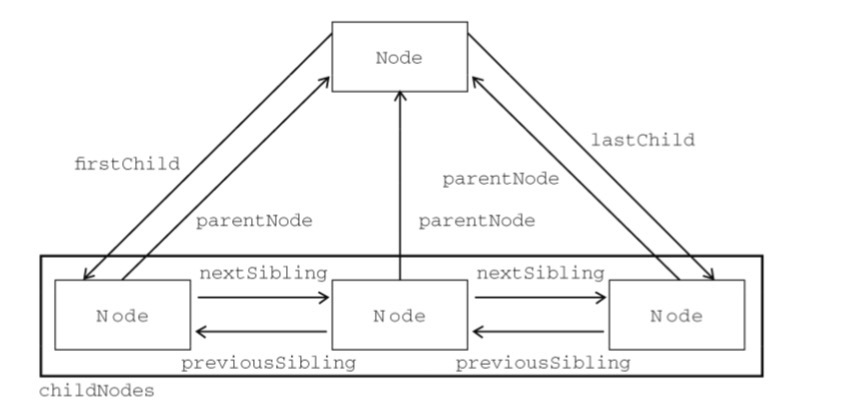
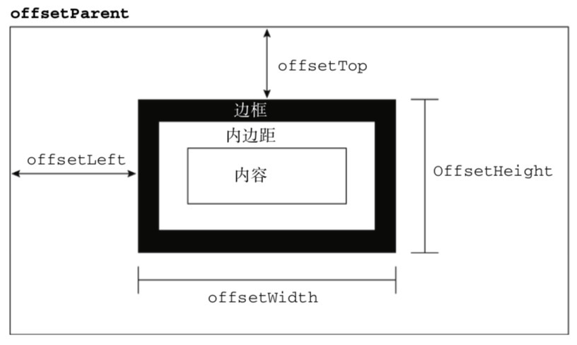
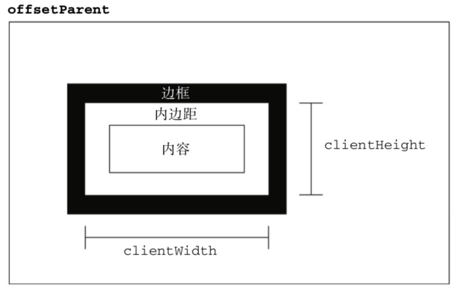
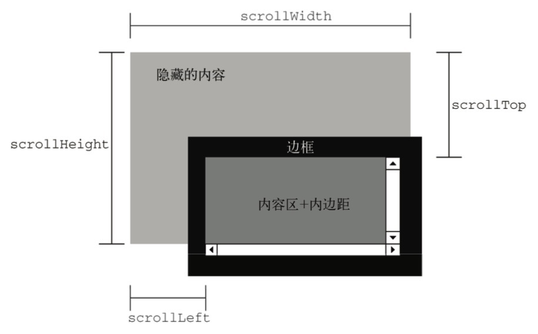
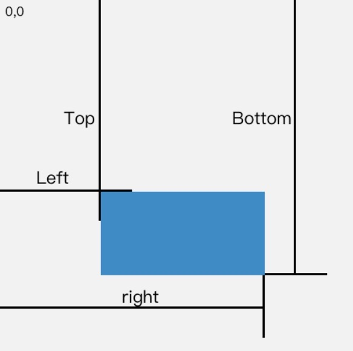

# 第十章 DOM
* 针对 HTML 和 XML 文档的一个 API

## 节点层次
* **文档元素**是最外层元素，每个文档只有一个文档元素，HTML 中是 `html`

### Node 类型
* js 所有节点类型都继承自 Node 类型
* `nodeType` 值为 node 的类型常量（12种）
    * 元素节点 Node.ELEMENT_NODE(1)
    * 文本节点 Node.TEXT_NODE(3)

##### nodeName 和 nodeValue 属性
* `nodeName` 元素标签名
* `nodeValue` 元素的值

##### 节点关系

* `hashChildNodes()` 
* `ownerDocument` 指向文档节点（最外层节点）

##### 操作节点
* `appendChild(newNode)` childNodes 列表末尾添加一个节点
    * 如果 newNode 已经存在 DOM 树中，会移动位置，而不是新建
* `insertBefore(NewNode, Node)` 将 NewNode 插入到 Node 前面的位置
* `replaceChild(NewNode, Node)`
* `removeChild(Node)`
以上方法通过父节点调用

---
以下方法所有节点都有

* `cloneNode(Boolean)`
    * true 深复制，整个子节点树
    * false 浅复制，节点本身
    * 返回的节点属于文档，但没有父节点
* `normalize()` 处理文档节点

### Document 类型
浏览器中 document 对象是 `HTMLDocument`（继承自 Document 类型）的一个实例，是 window 对象的一个属性

* nodeType = 9
* nodeName = "#document"
* nodeValue = null
* parentNode = null
* ownerDocument = null
* 子节点可能是一个 DocumentType(最多一个)、Element(最多一个)、ProcessingInstruction 或 Comment

##### 文档的子节点
* `document.documentElement` 始终指向 HTML 页面中的 `html` 元素
* `document.body` 指向 `body` 元素
* `document.doctype` 

##### 文档信息
浏览器专供属性，存在 HTTP 头部
* `document.title`
* `document.URL`
* `document.domain`
* `document.referrer`

##### 查找元素
* `document.getElementById()` 多个元素相同 id 则返回第一个
* `document.getElementsByTagName()` 返回 NodeList，HTML 文档中返回 `HTMLCollection` 对象
* `document.getElementsByName()` 返回 `HTMLCollection` 对象

##### 特殊集合
* `document.anchors`
* `document.forms`
* `document.images`
* `document.links` 带 href 特性的 a 元素

##### 文档写入
* `document.write()`
* `document.writeln()`
* `document.open()` 打开网页输出流
* `document.close()` 关闭网页输出流

### Element 类型
* nodeType = 1
* nodeName = 元素的标签名
* nodeValue = null
* parentNode 可能是 Document 或 Element
* 子节点可能是 Element、Text、Comment、ProcessingInstruction、CDATASection 或 EntityReference

`nodeName` 和 `tagName` 属性都是标签名

##### HTML 元素
HTMLElement 继承 Element 并添加了一些属性

* `id`
* `title`
* `lang`
* `dir`
* `className`

##### 操作特性
* `getAttribute(‘class’)`
* `setAttribute(‘class’, 'ft')`
* `removeAttribute('class')`

##### attributes 属性
`attributes` 属性中包含一个 `NamedNodeMap` 对象，元素每个特性都由一个 Attr 节点表示，节点保存在 `NamedNodeMap` 对象中
对象方法
* `getNamedItem(name)`
* `removeNamedItem(name)`
* `setNamedItem(node)`
* `item(pos)`

节点属性

* `nodeName`
* `nodeValue`

##### 创建元素
* `document.createElement(标签名)`
创建完成后需要调用前面介绍的方法将其添加到文档树中

### Text 类型（开始和结束标签中的文本）
* nodeType = 3
* nodeName = #text
* nodeValue 节点所包含的文本
* parentNode 是 Element
* 没有子节点

---
* `document.createTextNode()` 创建文本节点
* `normalize()` 相邻的文本节点之间不存在空格，可以将所有相邻的文本节点拼接起来
* `splitText()` 分割文本节点

### Comment 类型
* nodeType = 8
* nodeName = #comment
* nodeValue = 注释的内容
* parentNode 可能是 Document 或 Element
* 没有子节点

### CDATASection 类型
* 针对 XML 文档，表示 CDATA 区域
* 浏览器会解析为 Comment 或 Element

### DocumentType 类型
包含 doctype 有关的信息

### DocumentFragment 类型
### Attr 类型
元素的特性，不是 DOM 文档树的一部分

## DOM 操作技术
### 动态脚本
DOM 操作 script 标签
### 动态样式
DOM 操作 link 标签 和 style 标签
### 操作表格
DOM 操作 table 标签
### 使用 NodeList
* `NodeList`
* `NamedNodeMap`
* `HTMLCollection`
每当文档结构发生变化，它们都会更新，保存最新的信息

> 理解 DOM 的关键，就是理解 DOM 对性能的影响。DOM 操作往往是 JavaScript 程序中开销最大的 部分，而因访问 NodeList 导致的问题为最多。NodeList 对象都是“动态的”，这就意味着每次访问 NodeList 对象，都会运行一次查询。有鉴于此，最好的办法就是尽量减少 DOM 操作。

# 第十一章 DOM 扩展
## 选择符 API
* 参数为 CSS 选择符
    * `querySelector()` 返回元素
    * `querySelectorAll()` 返回 NodeList 快照

## 元素遍历
* `childElementCount` 不包括文本节点和注释
* `firstElementChild`
* `lastElementChild`
* `previousElementSibling`
* `nextElementSibling`

## HTML5
### 与类相关的扩充
* `getElementsByClassName()`
* `classList` DOMTokenList 的实例

### 焦点管理
* `activeElement` 当前获得焦点的元素
* `hasFocus()` 文档是否获得焦点（用户是否正在与页面交互）

### HTMLDocument 的变化
* `readyState` 属性
    * loading
    * complete
* `compatMode` 兼容模式
    * CSS1Compat 标准模式
    * BackCompat 混杂模式
* `head` 引用 head 标签元素

### 字符集属性
* `charset` 默认 ”UTF-16“
* `defaultCharset` 根据默认浏览器及操作系统设置

### 自定义数据属性
* 添加前缀 data-
* `dataset` 属性访问自定义属性的值
    * 值是 DOMStringMap 的一个实例
    * 也就是一个名值对的映射

### 插入标记
* `innerHTML` 属性
* `outerHTML` 属性
* `insertAdjacentHTML()` 方法
    * params1 插入位置
        * beforebegin
        * afterbegin
        * beforeend
        * afterend
    * params2 HTML 文本
* 内存与性能问题

### scrollIntoView() 方法
让当前的元素滚动到浏览器窗口的可视区域内

# 第十二章 DOM2 和 DOM3
DOM1 主要定义的是 HTML 和 XML 文档的底层结构，DOM2 和 DOM3 分为许多模块，分表描述 DOM 的某个非常具体的子集，目的在于扩展 DOM API

## 样式
定义样式

* `<link/>` 外部样式表
* `<style/>` 嵌入式样式
* `style 特性` 针对特定元素的样式

### 访问元素的样式
* 元素的 style 特性是 `CSSStyleDeclaration` 的实例
* CSS 属性的短线转为驼峰才能通过 js 访问
* float 是保留字所以 转为 cssFloat

### 操作样式表
CSSStyleSheet 类型表示的是样式表，继承自 StyleSheet，后者可以作为一个基础接口来定义非 CSS 样式表

### 元素大小
* 偏移量

* 客户区大小

所有偏移量、客户区大小都是只读的，每次访问要重新计算。避免重复访问，有需要可以保存下来。

* 滚动大小

* 确定元素大小
`getBoundingClientRect()` 返回 DOMRect 对象，包含四个值

## 遍历
* NodeIterator
* TreeWalker

## 范围
* 范围是选择 DOM 结构中特定部分，然后再执行相应操作的一种手段。
* 使用范围选区可以在删除文档中某些部分的同时，保持文档结构的格式良好，或者复制文档中的相应部分。