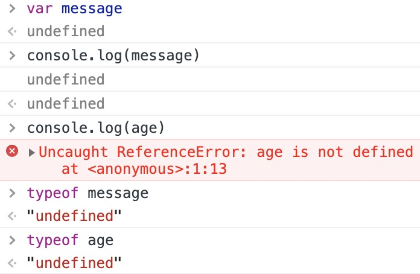
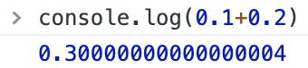

## 语法
ECMAScript 标示符采用驼峰大小写格式

### 严格模式 strict mode
在顶部添加代码 `"use strict";`
编译指示(pragma)，用于告诉支持的 JavaScript 引擎切换到严格模式。
函数体中包含指定函数在严格模式下执行。

### 变量
松散类型：可以用来保存任何类型的数据。每个变量仅仅用于保存值的占位符。

## 数据类型
5 基本数据类型 - `Undefined、Null、Boolean、Number、String`
1 复杂数据类型 - `Object`
`Oobject` 本质上是由一组无序的名值对组成的
ECMAScript 不支持任何创建自定义类型的机制

`typeof` 操作符，返回值（均为字符串）
未定义：`"undefined"`
布尔值：`"boolean"`
字符串：`"string"`
数值：`"number"`
对象或`null`：`"object"`
函数：`"function"`
特殊值 `null` 被认为是一个空的对象引用，因此返回 `"object"`。
safari 5 和 Chrome 7 及之前版本 `typeof 正则表达式` 会返回 `"function"`，而其他浏览器返回`"object"`
> 从技术角度讲，函数在 ECMAScript 中是对象，而不是一种数据类型。然而，函数也确实有一些特殊的属性，因此通过 `typeof` 操作符区分函数和其他对象是有必要的。

### Undefined 类型
`Undefined` 类型只有一个值，即 `undefined`
> 变量已声明但未初始化（message）：该变量的值为 `undefined`,`typeof` 返回`"undefined"`
> 若变量未声明（age）：只可以执行`typeof` 操作符，返回`"undefined"`，其他操作产生错误。
> 
>  

### Null 类型
`Null` 类型只有一个值，即 `null`，表示一个空对象指针，因此 `typeof null` 返回 `"object"`。
如果定义的变量准备用于保存对象，那么最好初始化为 `null`，可以直接判断是否已经保存了一个对象的引用。
``` JS
if (car != null) {
    ……
}
```
实际上，`undefined` 派生自 `null`，因此：
``` JS
alert(null == undefined); 
// true
```

### Boolean 类型
ECMAScript 中所有类型的值都有与这两个 Boolean 值等价的值。调用 `转型函数 Boolean()` 获得对应 Boolean 值。

| 数据类型 | true | false |
| --- | --- | --- |
| Boolean | true | false |
| String | 任何非空字符串 | ""（空字符串） |
| Number | 任何非零数字值（包括无穷大） | 0 和 NaN |
| Object | 任何对象 | null |
| Undefined | N/A | undefined |
N/A：not applicable 的缩写，不适用

### Number 类型
使用 [IEEE754](https://baike.baidu.com/item/IEEE%20754/3869922?fr=aladdin) 格式来表示整数和浮点数值（双精度数值）。
为了支持各种数值类型，ECMA-262定义了不同的数值字面量格式。
* 十进制
* 八进制（0）
* 十六进制（0x）
在进行算数计算时，都会转为十进制数值。
##### 浮点数值
浮点数值需要的内存空间是整数值的两倍。
6 个 0 以上，e表示法：3.125e7、3e-17
浮点数值最高精度 17 位小数，但在算数计算时精度远不如整数。
（IEEE745 数值的浮点计算通病，不是 ECMAScript 独有）

##### 数值范围
`Number.MIN_VALUE` 5e-324
`Number.MAX_VALUE` 1.7976931348623157e+308
`Number.POSITIVE_INFINITY` 或 `Infinity` 正无穷
`Number.NEGATIVE_INFINITY` 或 `-Infinity` 负无穷 
`isFinite()`有穷返回 `true`

##### NaN
* 任何涉及 NaN 的操作都会返回 NaN
* NaN 与任何值都不相等，包括自己本身
* `isNaN()` 函数判断变量是否**可以转为数值**

> isNaN(object):
> 首先调用对象的 valueOf() 方法，检查该方法的返回值是否可以转换为数值
> 如果不能，基于这个返回值再调用 toString() 方法，再测试返回值。

##### 数值转换
`Number()` 任何类型
`parseInt()` 字符串
`parseFloat()` 字符串
> parseInt 和 parseFloat 从第一个符合条件的字符开始转换，开始后若碰到不符合的字符，抛弃之后的字符。

### String 类型
* Unicode 字符组成的字符序列。
* ECMAScript 中双引号/单引号没有区别。

##### 字符字面量
字符字面量，即转义字符，被作为一个字符来解析。

##### 特点
* 不可改变
``` JS
var lang = "Java";
lang = lang + "Script";
// 首先创建一个能容纳 10 个字符的新字符串，然后填充 “Java” 和 “Script”，最后销毁原来的字符串。（不在原字符串上修改）
```

##### 转为字符串
* `toString()` 几乎每个值都有这个方法，`null` 和 `undefined` 值没有。
    * 通常不需要参数。
    * 调用数值的 `toString()` 方法时可以传递进制基数作为参数。
* 不知道是不是 `null` 或 `undefined` 的时候可以使用转型函数 `String()`
    * 如果值有 `toString()` 方法，调用
    * 如果值是 `null`，返回 `"null"`
    * 如果值是 `undefined`，返回 `"undefined"`

* `obj + ""` 和字符串加在一起

### Object 类型
* 对象是一组数据和功能的集合。
> 在 ECMAScript 中，`Object` 类型所具有的任何属性和方法也同样存在于更具体的对象中。
`Object` 的每个实例都具有下列属性和方法。
* `Constructor` 构造函数
* `hasOwnProperty(propertyName)` 检查给定的属性在当前对象实例中（而不是在实例的原型中）是否存在。参数（propertyName）为字符串
* `isProtorypeOf(object)` 检查传入的对象是否是另一个对象的原型
* `propertyIsEnumerable(propertyName)` 检查给定的属性是否能够使用 for-in 语句。参数（propertyName）为字符串
* `toLocaleString()` 根据本地规范进行格式化
* `toString()` 
* `valueOf()` 通常自动调用

> 从技术角度讲，ECMA-262 中对象的行为不一定适用于 JS 中的其他对象。如 BOM 和 DOM 中的对象属于宿主对象，宿主对象可能会也可能不会继承 Object。

## 操作符
操作符应用于对象时，通常会调用对象的 `valueOf()` 和（或）`toString()` 方法。

## 语句
### for-in
枚举对象的属性
``` JS
for (var propName in window) {
    document.write(propName);
}
```
属性没有顺序，所以先后顺序因浏览器而异。

### label
类似 go to 不建议使用

### with
简化多次编写同一个对象的工作
大量使用 with 会导致性能下降，不建议使用

### switch
比较值时使用全等 `===`

## 函数
未指定返回值的函数返回 `undefined`
> 函数要么始终返回一个值，要么永远都不要返回值。

### 理解参数
* 函数体内通过 arguments 对象来访问参数数组。
* ECMAScript 中的所有参数传递的都是值，不可能通过引用传递参数。
> 详看第四章 —— 传递参数

### 没有重载
不存在函数签名的特性，ECMAScript 函数不能重载
定义两个名字相同的函数，会被后面定义的函数覆盖
