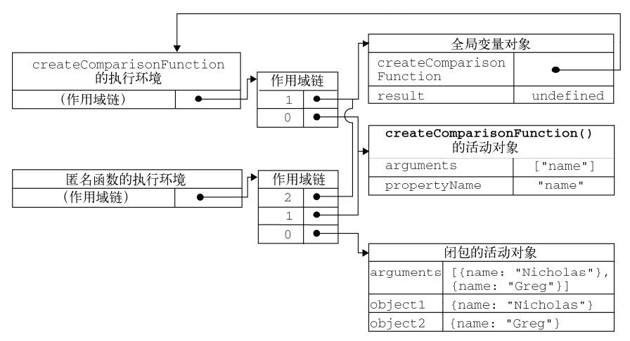

定义函数的方式
1. 函数声明
```js
functionName(); // 正确
function functionName() {
    ……
}
// 函数声明提升
// 执行代码前会读取函数声明，意味着可以把函数声明放在调用后面
```
2. 函数表达式
```js
functionName(); // 报错
var functionName = function() {
    ……
}
// 没有函数声明提升
// 使用前必须先赋值
```
> function 关键字后面没有标识符，所以叫**匿名函数**，也叫**拉姆达函数**。

## 递归
```js
function factorial(num) {
    if (num <= 1) {
        reutrn 1;
    } else {
        return num * factorial(num-1);
    }
}

var anotherFactorial = factorial;
factorial = null;
alert(anotherFactorial(4)); // 报错

// 因为调用 anotherFactorial(num) 时，函数内部会执行 factorial(num-1)，而此时 factorial 已经被置为 null

// 改为 arguments.callee 即可，如下
function factorial(num) {
    if (num <= 1) {
        return 1;
    } else {
        return num * arguments.callee(num-1);
    }
}
```

## 闭包
**闭包**是指(有权访问[另一个函数作用域中的变量]的)函数。
创建闭包的常见方式，就是在一个函数内部创建另一个函数。
```js
function createComparisonFunction(propertyName) {
    return function(object1, object2) {
        var value1 = object1[propertyName];
        var value2 = object2[propertyName];
        // 这个匿名函数的作用域链中包含 createComparisonFunction() 的作用域，所以这两行代码可以访问外部函数中的变量 propertyName
        
        if (value1 < value2) {
            return -1;
        } else if (value1 > value2) {
            return 1;
        } else {
            return 0;
        }
    }
}
```
> 当函数执行完毕后，局部活动对象会被销毁，内存仅保留全局作用域。但是闭包有所不同。
> 在另一个函数内部定义的函数会将包含它的函数（即外部函数）的活动对象添加到它的作用域链中。
> 因此，createComparisonFunction() 函数内部定义的匿名函数的作用域链中，实际上会包含外部函数 createComparisonFunction() 的活动对象。

在匿名函数从 createComparisonFunction() 中被返回后，它的作用域链被初始化为 包含 createComparisonFunction() 函数的活动对象和全局变量对象。
这样，匿名函数就可以访问在 createComparisonFunction() 中定义的所有变量。
同时，createComparisonFunction() 的活动对象由于被匿名函数的作用域链引用，在函数执行完毕之后不会被销毁。

由于闭包会携带外部函数的作用域，因此会比其他函数占更多的内存。所以要慎重使用闭包。

### 闭包与变量
* 闭包只能取得包含函数中每个变量的最新值
* 因为每个函数作用域链中都保存着外部函数的活动对象，是共享的，最后更新的内容会被引用。

### 关于 this 对象
* 匿名函数的执行环境具有全局性，this 通常指向 window。用 call 或 apply 改变制定环境时会指向其他对象。
```js
var name = "The Window";

var object = {
    name: "My Object",
    
    var that = this
    getNameFunc: function() {
        return function() {
            return this.name + " " that.name;
        };
    }
    
    getName: function() {
        return this.name
    }
};

alert(object.getNameFunc()());  // "The Window My Object"
alert(object.getName());  // "My Object"
```
### 内存泄漏
* 闭包会引用包含函数的整个活动对象，可以活动对象中的变量赋值 null 解除引用，保证内存正常回收。

## 模仿块级作用域（）私有作用域
```js
(function() {
    // 这里是块级作用域
})();
// 定义并立即调用了一个匿名函数
```
```js
// 理解过程
// 定义一个函数并立即调用
var someFunction = function() {
    // 这里是块级作用域
};
someFunction();

// 用函数的值直接取代函数名
function() {
    // 这里是块级作用域
}(); // 报错，函数声明后不能跟圆括号
(function() {
    // 这里是块级作用域
})(); // 正确，函数表达式可以跟圆括号
```

## 私有变量
* 严格来说，js 中没有私有成员的概念，所有的对象属性都是公有的
> 个人理解：oop 语言中私有成员不能被子类继承，而 js 中所有对象属性都能被继承，因此都是公有的

* 但有私有变量的概念，任何在函数中定义的变量都可以认为是私有变量，因为不能在函数的外部访问这些变量
* 私有变量包括
    * 函数的参数
    * 局部变量
    * 在函数内部定义的其他函数

###### 特权方法：有权访问私有变量和私有函数的公有方法
```js

// 在构造函数中定义特权方法
function MyObject() {

    // 私有变量和私有函数
    var privateVariable = 10;
    function privateFunction() {
        return false;
    }
    
    // 特权方法
    this.publicMethod = function() {
        privateVariable++;
        return privateFunction();
    }
}
```
### 静态私有变量
```js
(function() {
    // 私有变量和私有函数
    var privateVariable = 10;
    function privateFunction() {
        return fasle;
    }
    
    // 构造函数（没有var，全局变量）
    MyObject = function() {
    };
    
    // 公有/特权方法
    MyObject.prototype.publicMethod = function() {
        privateVariable++;
        return privateFunction();
    };
})();
```

### 模块模式
* 模块模式：为单例创建私有变量和特权方法
    * 单例：只有一个实例的对象

```js
var singleton = {
    name: value,
    method: function() {
        ……
    }
};
```
```js
var singleton = function() {
    // 私有变量和私有函数
    var privateVariable = 10;
    function privateFunction() {
        return false;
    }
    
    // 返回单例的公共接口
    return {
        publicProperty: true,
        publicMethod: function() {
            privateVariable++;
            return privateFunction();
        }
    }
}
```
### 增强的模块模式
```js
var singleton = function() { 
     //私有变量和私有函数
     var privateVariable = 10; 
     function privateFunction() { 
         return false; 
     }
 
     //创建对象
     var object = new CustomType();
     //添加特权/公有属性和方法
     object.publicProperty = true; 
     object.publicMethod = function() { 
         privateVariable++; 
         return privateFunction(); 
         }; 
     //返回这个对象
     return object; 
}();
```