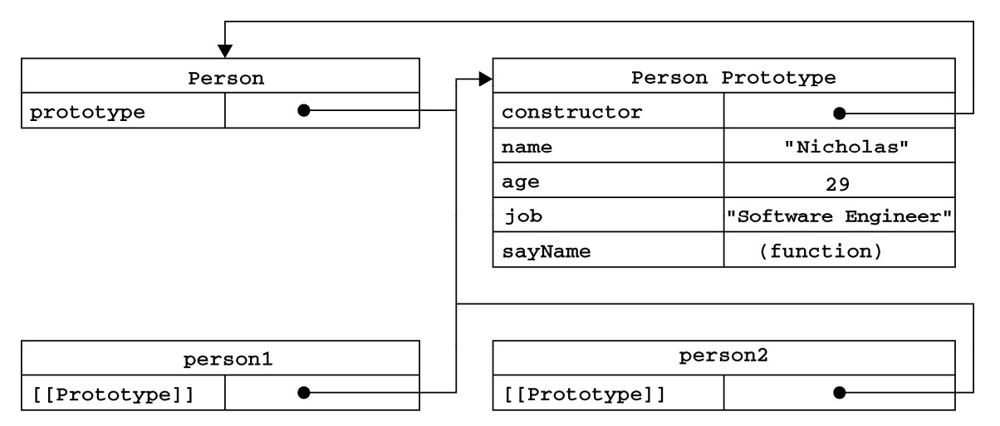

* 面向对象语言的标志是都有类的概念，通过类可以创建任意多个具有相同属性和方法的对象。
* 而 ECMAScript 中没有类的概念，因此它的对象和基于类的语言中的对象有所不同。
* ECMAscript 对象定义：<u>无序属性的集合，其属性可以包含基本值、对象或函数。</u>
* 每个对象都是基于一个引用类型创建的。可以是原生类型，也可以是开发人员定义的类型。

## 理解对象
### 属性类型
##### 属性数据
* `[[Configurable]]`:表示能否通过 delete 删除属性从而定义属性，能否修改属性的特性，或者能否把属性修改为访问器属性。
* `[[Enumerable]]`:表示能否通过 for-in 循环返回属性。
* `[[Writable]]`:表示能否修改属性的值。
* `[[Value]]`:包含设个属性的数据值。
> `Object.defineProperty(属性所在对象，属性的名字，描述符对象)`：修改属性默认的特性

##### 访问器属性
* `[[Configurable]]`:表示能否通过 delete 删除属性从而定义属性，能否修改属性的特性，或者能否把属性修改为访问器属性。
* `[[Enumerable]]`:表示能否通过 for-in 循环返回属性。
* `[[Get]]`:在读取属性时调用的函数，默认值 `undefined`。
* `[[Set]]`:在写入属性时调用的函数，默认值 `undefined`。
> 访问器属性不能直接定义，必须使用`Object.defineProperty()`来定义。

```js
var book = {
     _year: 2004,
     edition: 1
};
Object.defineProperty(book, "year", { 
     get: function() {
        return this._year;
 },
 set: function(newValue) { 
     if (newValue > 2004) { 
         this._year = newValue; 
         this.edition += newValue - 2004;
     }
 } 
});
book.year = 2005; 
alert(book.edition); // 2
```
### 定义多个属性
* `Object.defineProperties(对象，要添加和修改属性)` 通过描述赋一次定义多个属性
### 读取属性的特性
* `Object.getOwnPropertyDescriptor(属性所在的对象，要读取其描述符的属性名称)`返回值是一个对象，如果是访问器属性，这个对象的属性有 configurable、enumerable、get 和 set；如果是数据属性，这个对象的属性有 configurable、enumerable、writable 和 value。

## 创建对象
### 工厂模式
* 抽象了创建具体对象的过程
```js
function createPerson (name, age, job) {
    var o = new Object();
    o.name = name;
    o.age = age;
    o.job = job;
    o.sayName = function() {
        alert(this.name);
    };
    return o;
}
```
### 构造函数模式
* 定义在 Global 对象（浏览器即 window 对象）中
```js
function Person(name, age, job) {
    this.name = name;
    this.age = age;
    this.job = job;
    this.sayName = function() {
        alert(this.name);
    };
}
```

1. 创建一个新对象
2. 将构造函数的作用域赋给新对象（this 就指向了这个新对象）
3. 执行构造函数中的代码
4. 返回新对象
```js
var person = new Person("Greg", 27, "Doctor");
console.log(person.constructor == Person) // true
```

##### 将构造函数当作函数
* 构造函数与其他函数唯一的区别是调用方式不同
```js
// 构造函数
var person = new Person("Greg", 27, "Doctor");
person.sayName();
// 普通函数
Person("Greg", 27, "Doctor");
window.sayName();
// 在另一个对象的作用域中调用
var o = new Object();
Person.call(o, "Greg", 27, "Doctor");
o.sayName();
```

##### 构造函数的缺点
* 每个方法都要在每个实例上重新创建一遍
* 不同实例上的同名函数是不相等的
```js
function Person(name, age, job){ 
 this.name = name; 
 this.age = age; 
 this.job = job; 
 this.sayName = sayName; 
} 
function sayName(){ 
 alert(this.name); 
}
```
* 如果需要很多方法，就需要定义很多全局函数
### 原型模式
* 每个函数都有 prototype（原型）属性
    * 是一个指针，指向一个对象
        * 对象包含所有实例共享的属性和方法
        * 换句话说，prototype 就是通过调用构造函数而创建的对象实例的原型对象
* 好处
    * 让所有对象实例共享它所包含的属性和方法
    * 不必在构造函数中定义对象实例的信息，而且将这些信息直接添加到原型对象中
```js
function Person() {
}
Person.prototype.name = "Grey";
Person.prototype.age = 29;
Person.prototype.job = "Doctor";
Person.prototype.sayName = function() {
    alert(this.name);
}
```
##### 理解原型对象
* 只要创建了一个新函数，就会根据一组特定的规则为该函数创建一个 prototype 属性，这个属性指向函数的原型对象
* 默认情况下，所有原型对象会自动获得一个 constructor(构造函数) 属性，这个属性包含一个指向 prototype 属性所在函数（也就是构造函数）的指针
* `Person.prototype.constructor` 指向 `Person`

* 每个实例有一个`[[Prototype]]`（`__proto__`）属性，指向构造函数的原型对象
* `isPrototypeOf()`确定原型关系
    * `Person.prototype.isPrototypeOf(person)`

* `Object.getPrototypeOf()` 返回[[Prototype]] 的指针
    * `Object.getPrototypeOf(person) == Person.prototype`
* 在实例中修改属性值，会屏蔽原型中的同名属性
    * `delete person.name` 删除实例中的 name 属性，`console.log(person.name)` 将输出原型中的 name 属性 `Person.prototype.name`
* `hasOwnProperty()` 检测一个属性是否在实例中，false 来自原型

##### 原型与 in 操作符
* 单独使用
    * 属性 in 实例
    * 无论属性在实例还是在原型，都返回 true
* for-in
    * 返回可枚举的（enumerated）属性
    * 无论属性在实例还是在原型
> `Object.keys(对象)` 返回所有可枚举属性名
> `Object.getOwnPropertyNames(对象)` 返回所有属性名

##### 更简单的原型语法
```js
function Person() {
}

Person.prototype = {
    name: "Grey",
    age: 29,
    job: "Doctor",
    sayName: function() {
        alert(this.name);
    }
};
```

* 字面量形式创建原型
    * `Person.prototype.constructor` 不再指向 Person
    * （前面说）每创建一个函数，就会同时创建它的 prototype 对象，这个对象自动获得 constructor 属性
    * 这里完全重写了默认的 prototype 对象，constructor 属性指向 Object 构造函数
##### 原型的动态性
* 实例中的指针仅指向原型，而不指向构造函数
* 重写原型对象切断了现有原型与之前任何一件存在的对象实例直接的联系；对象实例引用的原型是重写之前的

##### 原型模式的缺点
如果原型包含引用类型值的属性，由于原型中的值是所有实例对象共享的，在一个实例对象中修改引用类型，会体现在别的实例对象中

### 组合使用构造函数模型和原型模式
* 构造函数模型用于定义实例属性
* 原型模式用于定义方法和共享属性

### 动态原型模式
* 在构造函数中检查是否存在某个方法，再决定是否需要初始化原型
```js
function Person (name, age, job) {
    this.name = name;
    this.age = age;
    this.job = job;
    if (typeof this.sayName != "function") {
        Person.prototype.sayName = function () {
            alert(this.name);
        }
    }
}
```
### 寄生构造函数模式

* 不能用 instanceof
* 不推荐
```js
// 寄生构造函数模式
function Person(name, age, job) {
    var o = new Object();
    o.name = name;
    o.age = age;
    o.job = job;
    o.sayName = function() {
        alert(this.name);
    };
    return o;
}
// 构造函数模式
function Person(name, age, job) {
    this.name = name;
    this.age = age;
    this.job = job;
    this.sayName = function() {
        alert(this.name);
    };
}
```
### 稳妥构造函数模式
* 稳妥对象
    * 没有公共属性，方法也不引用 this
* 安全的环境中禁止使用 this 和 new
```js
function Person(name, age, job) {
    var o = new Object();
    o.sayName = function() {
        alert(name);
    };
    return o;
}
```
* 只有 sayName() 能访问数据成员

## 继承
* 面向对象语言中
    * 接口继承
        * 只继承方法签名
    * 实现继承
        * 继承实际的方法
* ECMAScript 中函数没有签名，无法实现接口继承，故只支持实现继承
    * 依靠原型链
### 原型链
* 利用原型让一个引用类型继承另一个引用类型的属性和方法
> 构造函数 A 和原型 A 都有一个指向原型对象 A 的指针，而原型对象 A 有一个指向构造函数 A 的指针。
> 让原型对象 A 等于另一个类型的实例 B。
> 此时原型对象 A（也就是实例 B）将包含一个指向原型对象 B 的指针，原型对象 B 中包含一个指向构造函数 B 的指针。
> 假如原型 B 又是另一个类型的实例 C，那么上述关系依然成立，如此层层递进，就构成了实例与原型的链条。
> 这就是所谓原型链的基本概念。

##### 默认的原型
所有引用类型默认继承 Object，在原型链最后都是 Object 原型对象，包含一个指针指向 Object 构造函数。

##### 确定原型和实例的关系
* `实例 instanceof 构造函数` 实例的原型链中出现过构造函数就返回 true
* `原型对象.isPrototypeOf(实例)` 实例的原型链中出现过原型对象就返回 true

##### 对象字面量创建原型方法会重写原型链
```js
SubType.prototype = new SuperType();
// 导致上一行代码无效
SubType.prototype = {
    getSubValue: function() {
        return this.subproperty;
    },
    someOtherMethod: function() {
        return false;
    }
};
```
##### 原型链的缺点
* 不能给超类型的构造函数传递参数
### 借用构造函数（伪造对象/经典继承）
* 在子类型构造函数的内部调用超类型构造函数（利用 call 或 apply）
```js
function SuperType(name) {
    ……
}
function SubType() {
    // 继承了 SuperType
    SUperType.call(this, name);
}
```
* 可以给超类型的构造函数传递参数
### 组合继承（伪经典继承）
* 最常用
* 组合原型链和借用构造函数
* 原型链实现对原型属性和方法的继承
* 借用构造函数实现对实例属性的继承
* 缺点
    * 调用两次超类型构造函数
        * 创建子类型原型
        * 子类型构造函数内部

### 原型式继承
* `Object.create(作为新对象原型的对象， 作为新对象定义额外属性的对象)` 返回一个新对象

### 寄生式继承
* 创建一个仅用于封装继承过程的函数，该
函数在内部以某种方式来增强对象，最后再像真地是它做了所有工作一样返回对象
### 寄生组合式继承
* 通过借用构造函数来继承属性
* 通过原型链的混成形式来继承方法